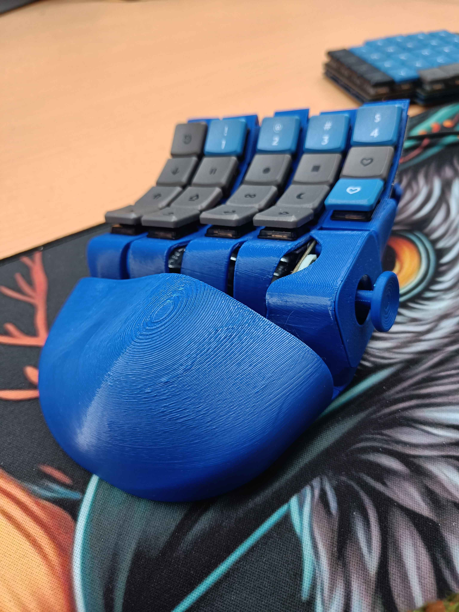
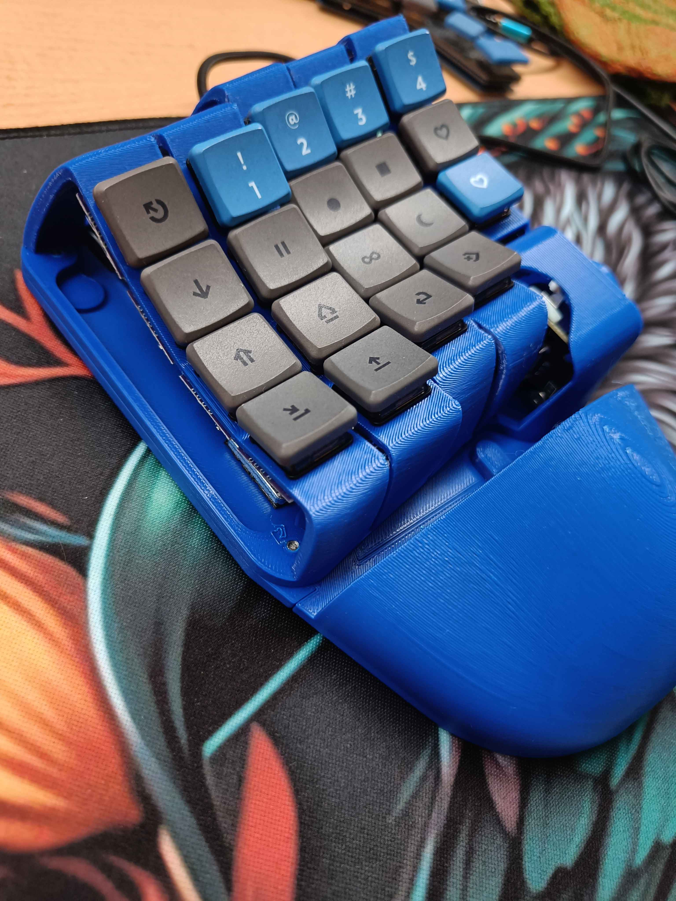

# PeepHand

a one hand gaming board to the exact specifications of Mrs. burkfers. Note the unusual key well: There's two pinky cols and only one index col.
The joystick is fully analog and can do WASD emulation  for games that don't support mixing input schemes (sadly too many).
The hand rest is dovetailed into the bottom plate and secures with one screw.
Battle-tested for several weeks now, wife is happy.

## bom

- controller: rp2040ce
- KY-023 joystick module
- 5x M3x6 FHCS
- 1x M3x6 FHCS if using hand rest
- 6x 8mm bumpon
- 19x choc v1 switch
- keycaps
- handwiring supplies of your choice

## firmware
[qmk](https://github.com/finrod09/qmk_firmware/tree/btzboards/keyboards/btz/peephand)

## license
CC 4.0 BY-NC-SA
